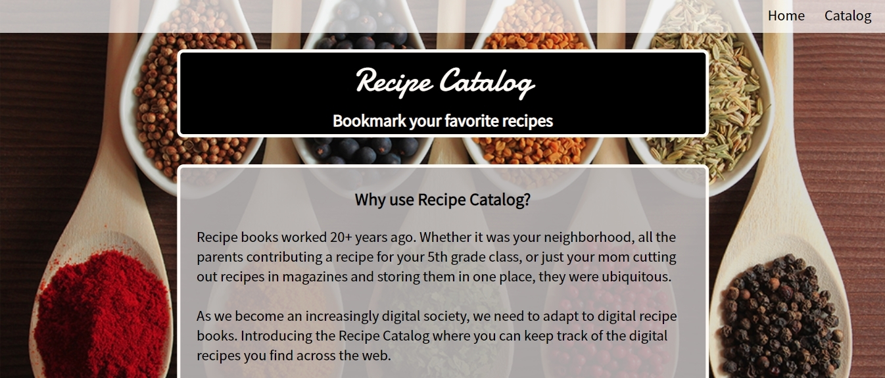
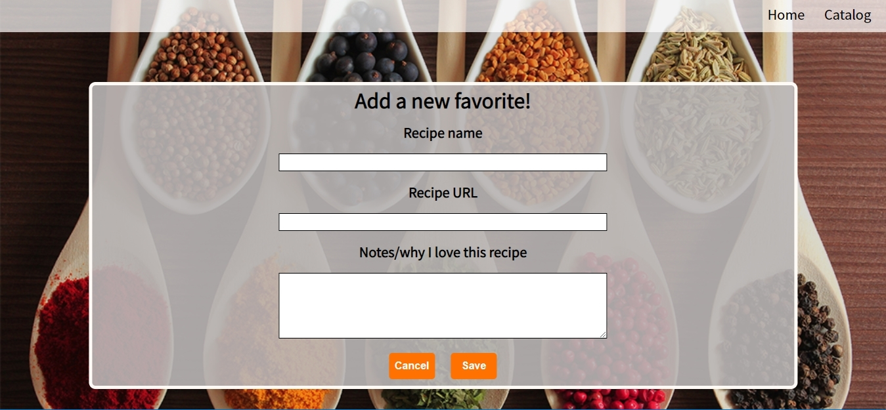

# Recipe Catalog

### Introduction
Recipe Catalog is an experimental React application that digitizes recipe books. 
Users are able to bookmark recipes they discover online, storing them in the Recipe Catalog.
Click [here](https://recipes-app-zeta.now.sh/) to test out the app 



### How it works
All recipes are bookmarked in a easy to read display. 
Adding a recipe is simply inputting the name, website link, and a note to attach to the recipe.
The name and the note is on the recipe page. Clicking on the title opens up the website in another tab.





## Getting Started
### Installing
Clone the repository and download dependencies.
```
$ git clone https://github.com/jmw7/recipe-client.git
$ cd recipe-client
$ npm install
```

### Launching
Start development server
```
$ npm run dev
```
This will automatically open a browser window with the project

### Testing
Run tests with Jest and Enzyme
```
$ npm run test
```

## Built With
 - [CSS3](https://developer.mozilla.org/en-US/docs/Web/CSS/CSS3)
 - [React](https://reactjs.org/)
